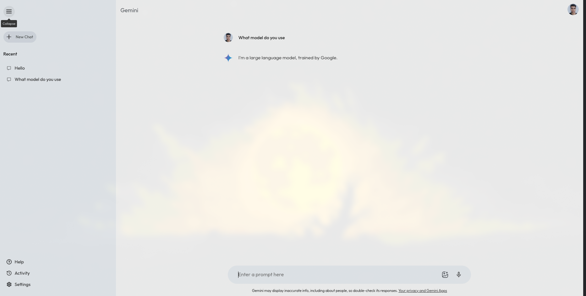

# Gemini AI Clone using React

Thank you for visiting the Gemini AI Clone project! This repository allows you to build a React-based interface inspired by Gemini, a large language model (LLM). Explore how LLMs work and design a smooth, intuitive experience for users.

## Demo
[](https://gemini-clone-r2j6wc73i-dhruv-krishn-as-projects.vercel.app/)  


## Main Features

- **Interactive Text Interface:** Engage with a simulated LLM through a clean, simple text-based interface.
- **Optional API Integration:** You can connect this project to the Google Gemini API for live LLM interactions (based on API availability and terms).
- **Flexible and Customizable:** Modify both the interface and functionality to suit your preferences.

## Setup Instructions

To get the project running locally, follow these steps:

1. **Clone the repository:**
    ```bash
    git clone https://github.com/Dhruv-krishn-a/Gemini-Clone-.git
    ```

2. **Install dependencies:**
    ```bash
    npm install
    ```

3. **Launch the development server:**
    ```bash
    npm run dev
    ```

## Project Layout

- **Components:** All the React components are inside the `src/components` folder.
- **Assets:** Any static files, like images and styles, are located in `src/assets`.
- **Utilities:** Helper functions and utilities can be found in `src/utils`.

## Important Notes

- This project is built using React.
- The code is structured to ensure clarity, ease of understanding, and maintainability.
- Creating your own LLM interface offers a great opportunity to learn both LLM technology and React development.

## Useful Links

- **Google Gemini API Documentation (Optional):** If you're integrating the API, check out the [Google Gemini API docs](https://ai.google.dev/gemini-api/docs/get-started/tutorial?lang=web) for comprehensive guidance.

## Contributions and Feedback

We value your input! Please feel free to open an issue or submit a pull request with your ideas for improvements.

---

Thanks for exploring the Gemini AI Clone with React! Enjoy coding!
